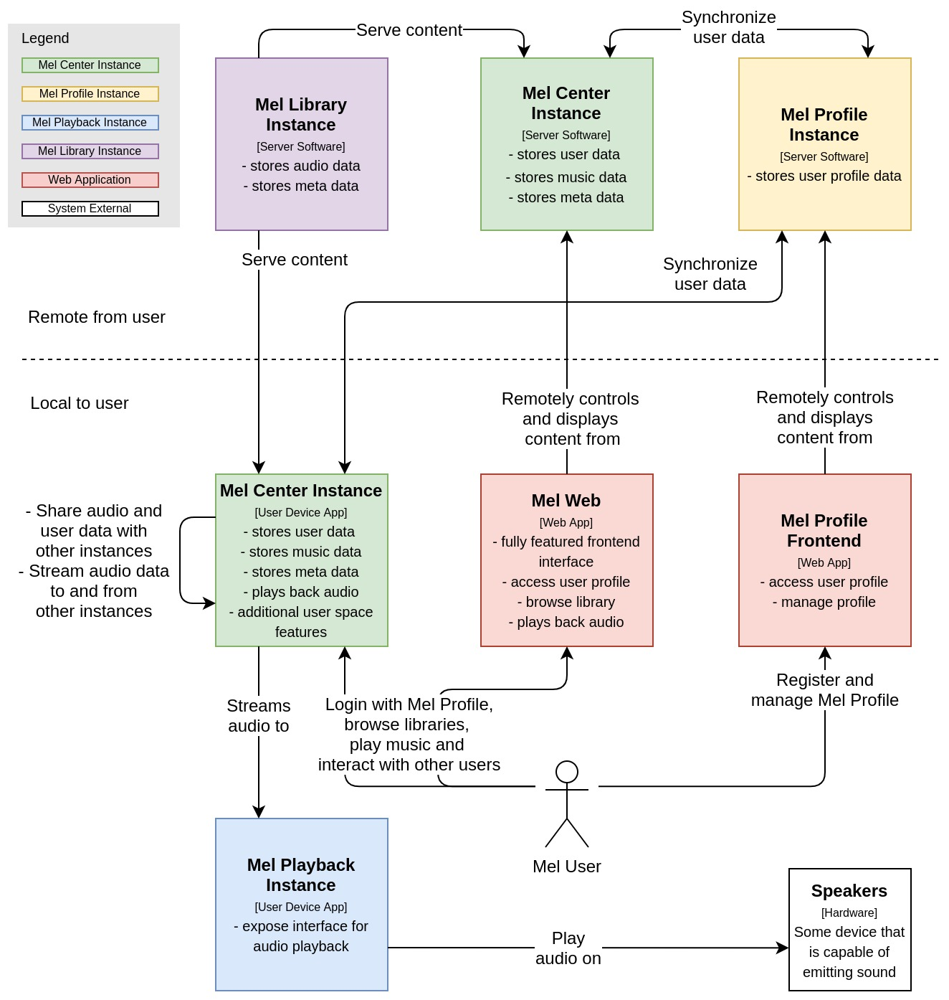

# Mel Specification

## Contents

- [1 Context](#1-user-experience)
  - [1.1 Music Playback](#11-music-playback)
    - [1.1.1 Playback Queue](#111-playback-queue)
  - [1.2 The Mel Ecosystem](#12-core-components)
    - [1.2.1 Mel Libraries](#121-mel-libraries)
      - [Streaming and synchronization](#streaming-and-synchronization)
    - [1.2.2 Mel Playback Managers](#122-mel-playback-managers)
    - [1.2.3 Mel User Profiles](#123-mel-user-profiles)
      - [Playlists](#playlists)
      - [Collections](#collections)
      - [Local Profiles](#local-profiles)
  - [1.3 Listening Parties](#13-listening-parties)
  - [1.4 Plugin System](#14-plugin-system)
- [2 Ecosystem Architecture](#2-ecosystem-architecture)
  - [2.1 User Authentication](#21-user-authentication)
  - [2.2 REST APIs](#22-rest-apis)
    - [2.2.1 Data Types](#221-data-types)
    - [2.2.2 Mel Library API](#222-mel-library-api)
    - [2.2.3 Mel User Profiles API](#223-mel-user-profiles-api)
    - [2.2.4 Mel Playback API](#224-mel-playback-api)
- [3 Design](#3-design)

## 1 Context

Mel is a music organizer and player, that connects to other instances of
itself, allowing synchronization of tracks and streaming between devices.
Additionally, you can host listening parties, where any number of people can
control the current playback, allowing them to add their music to the mix.
Lastly, it can playback music on any number of devices simultaneously.

### 1.1 Music Playback

Just like any music player, Mel can playback any music files on the device. It
features basic controls like play, pause, stop and skip, as well as a volume
control that scales logarithmically, matching the human's perception of
loudness. Tracks are played without gaps, allowing a smooth transition from
one to another. A seek bar indicates the current progress in the track and
allows the user to skip to a particular point.

#### 1.1.1 Playback queue

The playback queue defines the order of tracks to play. Selecting an album or
playlist for playback creates a new playback queue. Selecting a single track
for playback creates a queue based on the subsequent tracks. Playback queues
can also be generated from artists, albums or tracks similar tracks.  
The queue can be edited at any time, by added new tracks, albums or playlist,
which can be appended or inserted after the currently playing track.
Accordingly, tracks can also be removed from the queue at any time.
Furthermore, the user can reorder the queue, by manually selecting a tracks new
positing in the list or by shuffling the whole queue or just the tracks
remaining to play. When starting a new queue, the old ones get saved to return 
to them later or when accidentally overwriting the current queue.  
There are different looping modes to choose from. With no looping mode turned
on, the playback stops as soon as all tracks from the queue have been played.
Looping the whole queue will start the queue from the beginning, once all
tracks have been played. Lastly, just the current track can be looped.

### 1.2 The Mel Ecosystem

The Mel Ecosystem consists of multiple Mel Instances that communicate with
each other using a standardized language. As this language is open source,
anyone can study it and develop new system that can be integrated into the
broad ecosystem. Its upon the user how big the ecosystem might be, it may just 
exist in your local network at home or reach beyond to instances on the 
internet.

Each Mel Instance in the system can have different roles:

- **Mel Center Instance** - instance with fully fledged feature set. They can
  be configured to serve any purpose and are the most used ones.
- **Mel Profile Instance** - only deals with user data. They are mostly used
  to synchronize user profiles and are therefore publicly accessible.
- **Mel Playback Instance** - handles playback commands. They are used to just
  playback music and require another instance to send playback commands and
  stream the audio data. A use case might be to have a small device running
  this instance, which is hooked up to a set of speakers, so you can play
  music from any device.
- **Mel Library Instance** - collects data about music available on its device 
  and serves it to other instances. This might be used in more complex setups.

Most users will get in contact with just the Mel Center Instance and the Mel 
Profile Instance. A Mel Center Instance might be a mobile app, a desktop 
application or an application on any other enduser device. Mel Profile 
Instances on the other hand will run on a server with an internet address that 
anyone can use to access the instance. Here, users may register an account 
which they can use to login to any Mel Center Instance they use, which will 
synchronize all the user data with the Mel Profile Instance and across all 
devices.  
The other two instances, especially the Mel Library Instances are used im more 
advanced scenarios. Furthermore, these are not the only instance to exist. 
Depending on special use cases, new types of instances may be introduced.

The type of an instance is defined by what features it implements. There are 
three core components that make up each instance: the Mel Library, the Mel 
Playback Manager and the Mel User Profile. Each component specializes on 
specific features, so depending on what components the instance implements, 
one can derive its type. Therefore, a Mel Center Instance is also a Mel 
Profile Instance, a Mel Playback Instance and a Mel Library Instance, as it 
implements all components. It just configures them in different ways.  
More complex features are built from these components. For example, the music 
player uses the Mel Library component to get audio data, the Mel Playback 
Manager to output the audio data to audio interfaces and the Mel User Profiles 
to read Playlists.


#### 1.2.1 Mel Libraries

The library stores information about available music and serves the audio data
to any part that uses it. It fetches metadata from audio files in specified
locations, by parsing embedded tags or the file structure. As some information
is crucial for proper organization and display, users are notified about
missing data, which they can manually enter. Optionally, this data can be
added to either the file tags or structure. Extra data may automatically be
fetched by external services like Last.fm.  
Artist related information that is stored in a library:

- General information: name, description, thumbnail
- Available releases
- Available releases the artist participated on
- Popular tracks
- Similar artists

Release related information

- General information: title, year, cover image
- Available tracks
- Available formats, like MP3 or FLAC
- Similar releases

The user may add tags to artists, albums, tracks, playlists and collections to 
organize their music. These tags can be used in search or filters, making it 
possible to quickly create playback queues. These tags are presisted in the 
user's profile. It also is possible to incorporate tags of other users when 
browsing libraries.  
In addition to tags, which are plain text labels, there are section tags for 
tracks. These can be used to tag a specific section inside a track, such as 
intros, outros, skits and so on. This enables the user to skip long intros or 
outros by default.

##### Streaming and synchronization

The user may add remote libraries by providing its host address and logging
into it, to gain access to stream its music. Having multiple playback devices,
this method allows listening to your music on any device, without transferring
the file onto it. The user can choose what format to stream if multiple are
available, which may help with connections of low bandwidth. Permissions for
streaming from your library may be defined per user.  
Furthermore, it is not only possible to stream the music from a remote
library, but also to synchronize the actual audio data. This way it is
possible to listen to the tracks without connection to the source library.
When synchronizing tracks, the user can define what location the data should
be stored in and what format to use.  
Not only is it possible to synchronize data from a remote library with the
local, but also the other way around. This, for example, may be used to load
music on your mobile phone from your computer, without using the phone itself.
Additionally, the user may delete audio data from a remote library. What each
user can and cannot do with the library is defined in a set of permissions by
one of the library's administrators. Access information to individual
libraries is stored in the user's profile, so they can be used on any device
logged in.

#### 1.2.2 Mel Playback Managers

The playback manager enables actual playback of audio data, as it knows how to
connect to the device's audio interface. A device that implements the playback
manager is also called a playback device. Users can gain access to playback
devices to use, to listen to their music. They can add any number of playback
devices, which will output the music synchronously on all of them. User's
permission to use the playback device can be defined by an administrator.
Usually, all users have full access to the playback manager of the physical
device they are using. Limiting user access makes more sense when using the
device remotely, to stream music to it or play music that is local to that it.
Access to playback devices is stored in the user's profile, which allows easy
access when logging into other devices.

#### 1.2.3 Mel User Profiles

Users may create a user profile by registering on a public Mel Profile
Instance. With this profile, the user can log into any Mel instance to
synchronize data with it. It is used to give permissions on any Mel Library or
Mel Playback Device and enables connecting with other Mel Users. All data like
playback history, liked tracks, playlists, collections, access to Mel
Libraries and Mel Playback devices are stored and synchronized with every
device the user logs into. This makes it easy to have lists of your favorite
music, your playlist and collections and personal recommendations everywhere
the user uses Mel. Adding friends enables sharing and recommending favorite
music, work together on playlists and collections and invite them to listening
parties when visiting each other. Friends can view the user's profile, while
the user can decide what they can and cannot see of their listening behavior.

##### Playlists

Playlists are lists of tracks with a user-defined order. Besides adding,
reordering and removing tracks, the user can set a title and a cover image for
better recognition. The user can also grant editing access to friends, to
collaboratively work on them. What each friend is allowed to do with the
playlist can be defined with individual permissions.
Playlists are synchronized with the user's profile, so the user has access to
it from anywhere.

##### Collections

Collections are very similar to playlists, however, they are different in that
they contain artists or albums and don't have a defined order. They are used
to better organize the music when having a big library. For example, the user
may categorize artists by genre or albums by period (like 80s, 90s and so on).
As with playlists, the user can set a title and cover image for better
recognition. Grant access to friends to collaboratively work on collections.

##### Local profiles

Having a profile that is registered on a public Mel User Instance is not
necessary to use Mel. Alternatively, the user can create a profile, that is
local, which means it only exists on the device it was created on. Only usage
information generated on that device is stored in the profile. There is no
synchronization with profiles on other devices. Furthermore, all social
features like friends and collaborative editing of playlists and collections
are disabled.  
Getting access to other libraries or playback devices is still possible, but
must be confirmed by an administrator every time access to it is requested.
When the access session for the library or device expires, an administrator
has to confirm access again.

[↑ top](#mel-specification)

### 1.3 Listening Parties

Listening parties allow multiple users to take control over one player. Every
participant's available music and playback devices are merged for everyone in
the party to use. Anyone can edit the playing queue, add playback devices and
control the playback itself.  
To create a party, one user initializes a party on their devices. After that,
more users are added by inviting them using their unique profile handle, or
providing a code, which users enter on their device to join the party. Users
can be added to or removed from the party at any time.  
As every participant stores the party data in their profile, so there is no
single host to the party. Additionally, when the party is over, every
participant can revisit the tracks of past parties, to, for example, create
playlists from it. For better identification, each party has a title.

[↑ top](#mel-specification)

### 1.4 Plugin System

A plugin system allows third parties to extend Mel's capabilities. This also 
enables users to only install plugins with features they intend to use, rather 
than dealing with potential bugs and other issues caused by features they 
never use. So far there are two types of plugins: Library plugins and Profile 
plugins.  
Library plugins enable the user to introduce new content sources to their 
library, such as music from YouTube, Spotify, SoundCloud and so on. Profile 
plugins allow users to connect their Mel profile with profiles of external 
services like Last.fm.

[↑ top](#mel-specification)

## 2 Ecosystem Architecture

The Mel Ecosystem consists of **Mel Instances** that communicate with 
each other using the **HTTP 1.1** protocol with a **standardized REST 
API**. The HTTP methods POST, GET, PUT and DELETE are used to proactively 
invoke an action and transfer data to and from a remote Mel Instance. Server 
sent events (SSEs) are used notify other instances of events, upon which they 
react accordingly.



### 2.1 User Authentication

TODO:

- describe how user authenticate themselves on different instances

[↑ top](#mel-specification)

### 2.2 REST APIs

Each instance in the ecosystem is supposed to implement at least one of the 
following APIs in order for other instances to communicate with it properly.

TODO:

- Using Hypermedia: \_links to show related endpoints, expand query and 
\_embedded to fetch multiple data sets in one call
- REST API specification

#### 2.2.1 Data Types

##### General

###### GMID

```json
String
```

##### Mel Library

###### Artist

```json
{
  "gmid": "GMID",
  "name": "String",
  "description": "String",
  "releases": "Array<Album:Short>",
  "feature_releases": "Array<Album:Short>"
}
```

###### Album

**Full:**

```json
{
  "gmid": "GMID",
  "title": "String",
  "year": "Integer",
  "artist": {
    "gmid": "GMID",
    "name": "String"
  },
  "tracks": "Array<Track:Short>"
}
```

**Short:**

```json
{
  "gmid": "GMID",
  "title": "String",
  "year": "Integer"
}
```

###### Track

**Full:**

```json
{
  "gmid": "GMID",
  "title": "String",
  "artist": {
    "gmid": "GMID",
    "name": "String"
  },
  "album": {
    "gmid": "GMID",
    "title": "String"
  },
  "duration": "Integer",
  "locations": "Array<Location>"
}
```

**Short:**

```json
{
  "gmid": "GMID",
  "title": "String",
  "duration": "Integer"
}
```

###### Location

```json
{
  "gmid": "GMID",
  "host": "String"
}
```

#### 2.2.2 Mel Library API

#### 2.2.3 Mel User Profiles API

#### 2.2.4 Mel Playback API

[↑ top](#mel-specification)

## 3 Design

TODO:

- typograhy
- colors

## Glossary

TODO:
- update terms

##### Mel Instance

Software that implements at least one of the three main components of Mel and
exposes a Mel Api of at least one of them.

##### User Host Instance

A Mel Instance, which implements the Mel User Database and its REST API.

##### Music Host Instance

A Mel Instance, which implements the Mel Music Database and its REST API.

##### Generic Music Identifier

An ID that is generated from a tracks essential meta data.
See [GMID Generator](https://github.com/FritzHeiden/gmid-generator)

